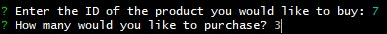
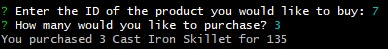

# Bamazon

## Welcome to Bamazon!

An app where you can shop for your favorite items at the click of a button. Just enter the product id of the product you'd like to purchase, then the quantity, and "BAMAZON!" You're all set!

Step one, select product by entering the product ID: 
;

Step two, enter quantity: 
;

Step three, you've purchased your product and it has depleted from the MySQL database! 
;

## Instructions
* Fork It
* Clone It
* Run queries in MySQL
* Open in terminal or bash
* Type 'nodemon bamazonCustomer.js' to initiate application, then follow instructions (refer to screenshots above)

## Technologies used: 
* Node
* MySQL

## Code Sample
The code uses a prompt to ask the user what they would like to buy, and how many:
~~~
 inquirer.prompt([
            {
                name: "id",
                message: "Enter the ID of the product you would like to buy:"
            },
            {
                name: "quant",
                message: "How many would you like to purchase?"
            }
~~~

It follows with a .then to check stock in MySQL and update accordingly:
~~~
       ]).then(function (answers) {
            var id = answers.id; //this gives us users id choice
            var query2 = `SELECT * FROM products WHERE id="${id}"`
            connection.query(query2, function(err, data){
                if (err) throw err;
                var quantity = answers.quant;
                var currQuantity = data[0].stock_quantity;
                var newQuantity = currQuantity - answers.quant;
                var cost = data[0].price*quantity;
                var name = data[0].product_name;
                if (newQuantity < 0) {
                    console.log("Insufficient stock, please choose another product!")
                    displayProd();
                } else {
                    updateProduct(id, newQuantity, cost, name, quantity);
                }
 ~~~

## Contact
* jlynnraz@gmail.com
* [LinkedIn](https://www.linkedin.com/in/jaimee-razee/)
* [Portfolio](https://jlynnraz.github.io/Portfolio2/)

